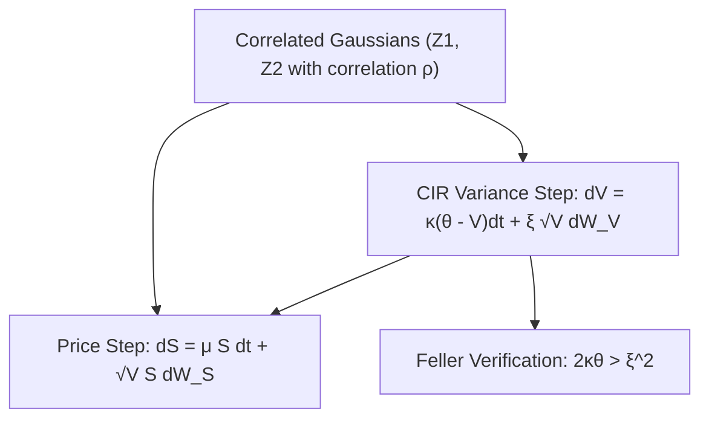

# Heston Stochastic Volatility Simulator Skill

Two-factor coupled stochastic differential equation solver featuring CIR variance and correlated Brownian noise.

## Features
- **100% Python Standard Library**: Full truncation Euler scheme for non-negative variance.
- **Correlated Noise Injection**: Cholesky decomposition of 2D Wiener processes.
- **Feller Boundary Check**: Automatic analytical positivity verification.
